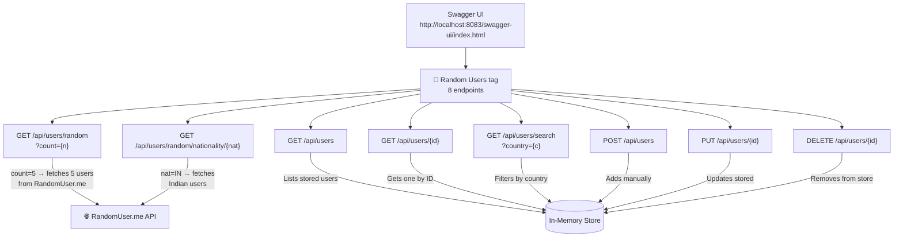
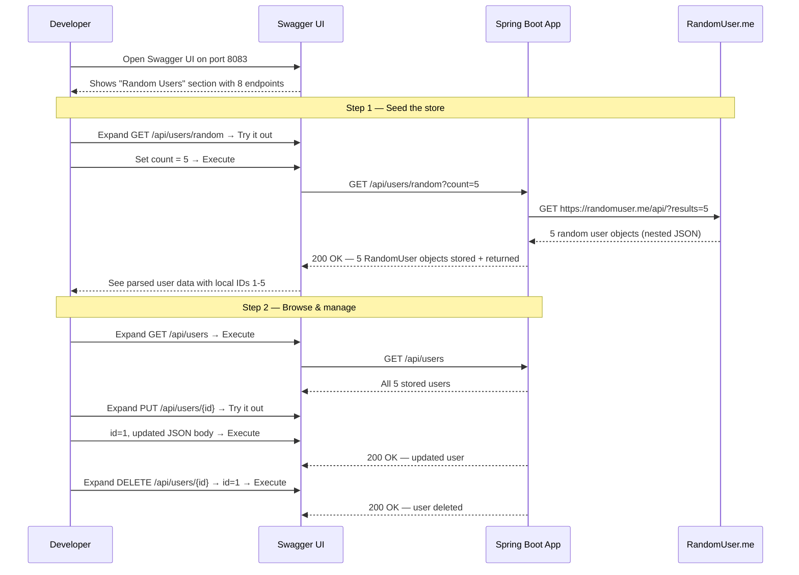
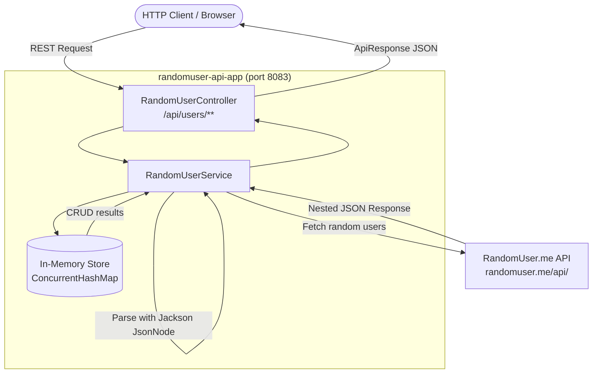
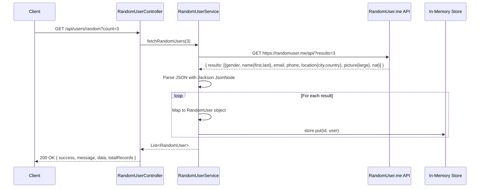
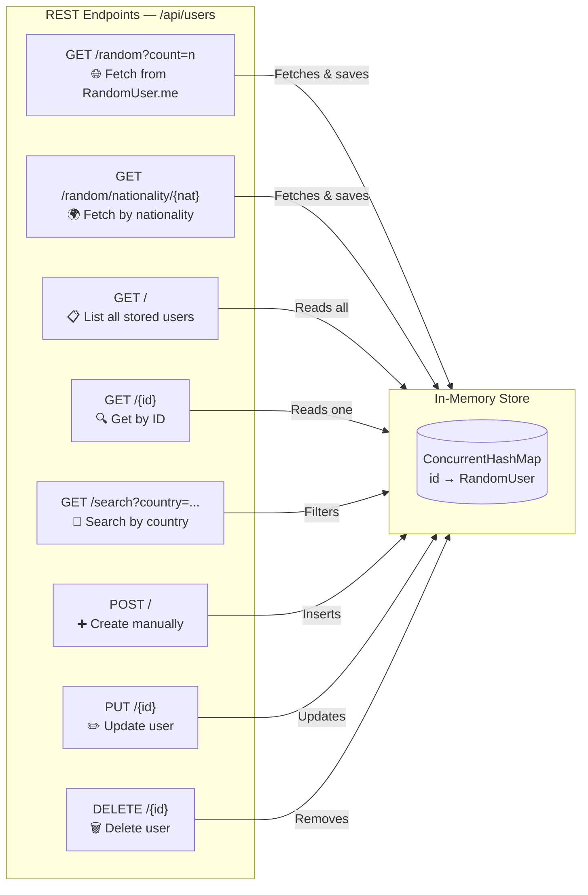
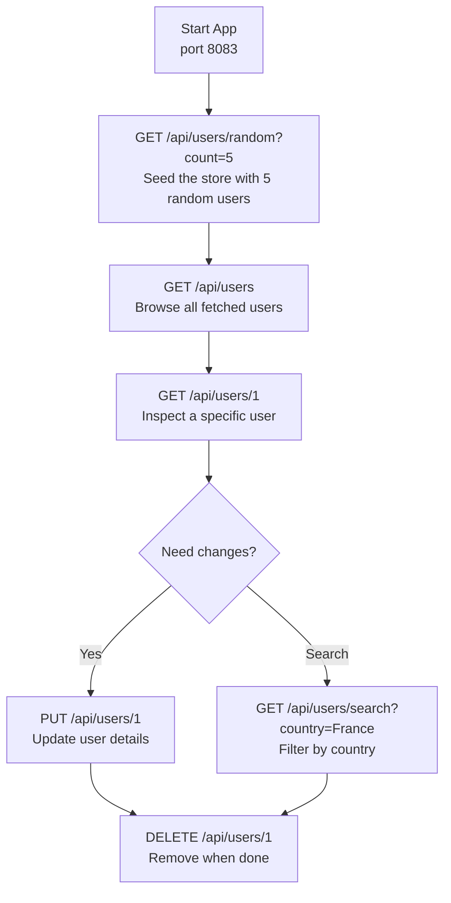

# RandomUser API Application

A Gradle-based Spring Boot application that integrates with the **RandomUser.me API** to generate and manage random user profiles. Fetched users are stored in-memory and fully manageable via REST CRUD endpoints.

- **Base URL:** `http://localhost:8083`
- **External API:** [RandomUser.me](https://randomuser.me)
- **Port:** `8083`
- **Swagger UI:** `http://localhost:8083/swagger-ui/index.html`
- **OpenAPI JSON:** `http://localhost:8083/api-docs`

---

## Swagger UI

This project ships with **springdoc-openapi** (`v1.7.0`), which auto-generates a fully interactive API explorer from the controller's OpenAPI annotations.

### Access URLs (once the app is running)

| Resource | URL |
|---|---|
| Swagger UI (interactive) | http://localhost:8083/swagger-ui/index.html |
| OpenAPI JSON spec | http://localhost:8083/api-docs |
| OpenAPI YAML spec | http://localhost:8083/api-docs.yaml |

### Swagger UI Endpoint Map



### Try-It-Out Workflow



### Swagger Configuration (application.properties)

```properties
springdoc.api-docs.path=/api-docs
springdoc.swagger-ui.path=/swagger-ui.html
springdoc.swagger-ui.operationsSorter=method
springdoc.swagger-ui.tagsSorter=alpha
springdoc.swagger-ui.try-it-out-enabled=true
```

### Annotation Reference

| Annotation | Applied To | Purpose |
|---|---|---|
| `@Tag` | Controller class | Groups all 8 endpoints under "Random Users" in the UI |
| `@Operation` | Each method | One-line summary + detailed description shown when expanded |
| `@ApiResponses` | Each method | Documents 200 / 201 / 404 / 500 with body schemas |
| `@Parameter` | Path/query params | Describes `count`, `nat`, `country`, `id` with examples |
| `@RequestBody` (OAS) | POST/PUT body | Schema + pre-filled JSON example for user creation/update |
| `@ExampleObject` | Inside content | Injects realistic JSON into Swagger's "Example Value" panel |
| `@Schema` | Model reference | Links response body to the `ApiResponse` or `RandomUser` class |

---

## Architecture Overview



---

## Data Flow — Fetch Random Users



---

## Getting Started

### Prerequisites
- Java 11+
- Gradle 7.6+ (or use the included `gradlew` wrapper)
- Internet connection (for fetching from RandomUser.me)

### Run the Application

```bash
# First-time setup: generate Gradle wrapper
gradle wrapper --gradle-version 7.6.1

# Build
./gradlew clean build -x test

# Run
./gradlew bootRun
```

The app starts at `http://localhost:8083`.

---

## RandomUser Data Model

| Field         | Type   | Description                            | Example                        |
|---------------|--------|----------------------------------------|--------------------------------|
| `id`          | Long   | Local auto-assigned ID                 | `1`                            |
| `gender`      | String | Gender of the user                     | `"male"`, `"female"`           |
| `firstName`   | String | First name                             | `"John"`                       |
| `lastName`    | String | Last name                              | `"Doe"`                        |
| `email`       | String | Email address                          | `"john.doe@example.com"`       |
| `phone`       | String | Phone number                           | `"011-123-4567"`               |
| `city`        | String | City of residence                      | `"Paris"`                      |
| `country`     | String | Country of residence                   | `"France"`                     |
| `picture`     | String | URL to profile picture                 | `"https://randomuser.me/..."` |
| `nationality` | String | Nationality code (ISO)                 | `"FR"`, `"US"`, `"IN"`         |

---

## Response Envelope

All endpoints return a standard wrapper with a record count:

```json
{
  "success": true,
  "message": "Descriptive message",
  "data": { ... },
  "totalRecords": 5
}
```

---

## API Reference

### Supported Nationality Codes

The following nationality codes can be used with the `/random/nationality/{nat}` endpoint:

`AU` `BR` `CA` `CH` `DE` `DK` `ES` `FI` `FR` `GB` `IE` `IN` `IR` `MX` `NL` `NO` `NZ` `RS` `TR` `UA` `US`

---

### 1. GET — Fetch Random Users from External API

Calls RandomUser.me, parses the response, stores in local store, and returns the list.

```
GET /api/users/random?count={n}
```

**Query Parameter:** `count` — number of users to fetch (default: `1`)

```bash
# Fetch 5 random users
curl -X GET "http://localhost:8083/api/users/random?count=5"

# Fetch 1 user (default)
curl -X GET "http://localhost:8083/api/users/random"
```

**Success Response (200 OK):**
```json
{
  "success": true,
  "message": "Random users fetched successfully",
  "data": [
    {
      "id": 1,
      "gender": "female",
      "firstName": "Emily",
      "lastName": "Thompson",
      "email": "emily.thompson@example.com",
      "phone": "041-123-4567",
      "city": "Melbourne",
      "country": "Australia",
      "picture": "https://randomuser.me/api/portraits/women/55.jpg",
      "nationality": "AU"
    },
    {
      "id": 2,
      "gender": "male",
      "firstName": "Luca",
      "lastName": "Rossi",
      "email": "luca.rossi@example.com",
      "phone": "040-987-6543",
      "city": "Rome",
      "country": "Italy",
      "picture": "https://randomuser.me/api/portraits/men/22.jpg",
      "nationality": "IT"
    }
  ],
  "totalRecords": 2
}
```

---

### 2. GET — Fetch Users by Nationality

Fetches a random user filtered by nationality code from RandomUser.me.

```
GET /api/users/random/nationality/{nat}
```

**Path Parameter:** `nat` — ISO nationality code (e.g. `US`, `IN`, `FR`)

```bash
# Fetch a random Indian user
curl -X GET "http://localhost:8083/api/users/random/nationality/IN"

# Fetch a random US user
curl -X GET "http://localhost:8083/api/users/random/nationality/US"
```

**Success Response (200 OK):**
```json
{
  "success": true,
  "message": "Users fetched by nationality successfully",
  "data": [
    {
      "id": 3,
      "gender": "male",
      "firstName": "Arjun",
      "lastName": "Sharma",
      "email": "arjun.sharma@example.com",
      "phone": "091-9876543210",
      "city": "Mumbai",
      "country": "India",
      "picture": "https://randomuser.me/api/portraits/men/10.jpg",
      "nationality": "IN"
    }
  ],
  "totalRecords": 1
}
```

---

### 3. GET — List All Stored Users

Returns all users currently held in the in-memory store (accumulated from all fetch and create calls).

```
GET /api/users
```

```bash
curl -X GET "http://localhost:8083/api/users"
```

**Success Response (200 OK):**
```json
{
  "success": true,
  "message": "All users retrieved successfully",
  "data": [
    { "id": 1, "gender": "female", "firstName": "Emily", ... },
    { "id": 2, "gender": "male",   "firstName": "Luca",  ... },
    { "id": 3, "gender": "male",   "firstName": "Arjun", ... }
  ],
  "totalRecords": 3
}
```

---

### 4. GET — Get User by ID

Retrieves a single user from the in-memory store by their local ID.

```
GET /api/users/{id}
```

**Path Parameter:** `id` — local user ID (Long)

```bash
curl -X GET "http://localhost:8083/api/users/1"
```

**Success Response (200 OK):**
```json
{
  "success": true,
  "message": "User retrieved successfully",
  "data": {
    "id": 1,
    "gender": "female",
    "firstName": "Emily",
    "lastName": "Thompson",
    "email": "emily.thompson@example.com",
    "phone": "041-123-4567",
    "city": "Melbourne",
    "country": "Australia",
    "picture": "https://randomuser.me/api/portraits/women/55.jpg",
    "nationality": "AU"
  },
  "totalRecords": 1
}
```

**Not Found (404):**
```json
{
  "success": false,
  "message": "User not found with id: 99",
  "data": null,
  "totalRecords": 0
}
```

---

### 5. GET — Search Users by Country

Filters stored users by country name (case-insensitive).

```
GET /api/users/search?country={country}
```

**Query Parameter:** `country` — full country name (e.g. `Australia`, `India`, `United States`)

```bash
curl -X GET "http://localhost:8083/api/users/search?country=Australia"
```

**Success Response (200 OK):**
```json
{
  "success": true,
  "message": "Users searched by country successfully",
  "data": [
    {
      "id": 1,
      "gender": "female",
      "firstName": "Emily",
      "lastName": "Thompson",
      "email": "emily.thompson@example.com",
      "phone": "041-123-4567",
      "city": "Melbourne",
      "country": "Australia",
      "picture": "https://randomuser.me/api/portraits/women/55.jpg",
      "nationality": "AU"
    }
  ],
  "totalRecords": 1
}
```

---

### 6. POST — Create a User Manually

Manually add a user to the local in-memory store without calling RandomUser.me.

```
POST /api/users
Content-Type: application/json
```

**Request Body:**
```json
{
  "gender": "male",
  "firstName": "Vijay",
  "lastName": "Kumar",
  "email": "vijay@example.com",
  "phone": "9876543210",
  "city": "Chennai",
  "country": "India",
  "picture": "https://example.com/photo.jpg",
  "nationality": "IN"
}
```

```bash
curl -X POST "http://localhost:8083/api/users" \
  -H "Content-Type: application/json" \
  -d '{
    "gender": "male",
    "firstName": "Vijay",
    "lastName": "Kumar",
    "email": "vijay@example.com",
    "phone": "9876543210",
    "city": "Chennai",
    "country": "India",
    "picture": "https://example.com/photo.jpg",
    "nationality": "IN"
  }'
```

**Success Response (201 Created):**
```json
{
  "success": true,
  "message": "User created successfully",
  "data": {
    "id": 4,
    "gender": "male",
    "firstName": "Vijay",
    "lastName": "Kumar",
    "email": "vijay@example.com",
    "phone": "9876543210",
    "city": "Chennai",
    "country": "India",
    "picture": "https://example.com/photo.jpg",
    "nationality": "IN"
  },
  "totalRecords": 1
}
```

---

### 7. PUT — Update a User

Update an existing stored user by their local ID.

```
PUT /api/users/{id}
Content-Type: application/json
```

**Path Parameter:** `id` — local user ID (Long)

```bash
curl -X PUT "http://localhost:8083/api/users/4" \
  -H "Content-Type: application/json" \
  -d '{
    "gender": "male",
    "firstName": "Vijay",
    "lastName": "Kumar",
    "email": "vijay.updated@example.com",
    "phone": "9876543210",
    "city": "Bangalore",
    "country": "India",
    "picture": "https://example.com/photo-updated.jpg",
    "nationality": "IN"
  }'
```

**Success Response (200 OK):**
```json
{
  "success": true,
  "message": "User updated successfully",
  "data": {
    "id": 4,
    "gender": "male",
    "firstName": "Vijay",
    "lastName": "Kumar",
    "email": "vijay.updated@example.com",
    "phone": "9876543210",
    "city": "Bangalore",
    "country": "India",
    "picture": "https://example.com/photo-updated.jpg",
    "nationality": "IN"
  },
  "totalRecords": 1
}
```

**Not Found (404):**
```json
{
  "success": false,
  "message": "User not found with id: 99",
  "data": null,
  "totalRecords": 0
}
```

---

### 8. DELETE — Delete a User

Remove a user from the local in-memory store by ID.

```
DELETE /api/users/{id}
```

**Path Parameter:** `id` — local user ID (Long)

```bash
curl -X DELETE "http://localhost:8083/api/users/4"
```

**Success Response (200 OK):**
```json
{
  "success": true,
  "message": "User deleted successfully",
  "data": null,
  "totalRecords": 0
}
```

**Not Found (404):**
```json
{
  "success": false,
  "message": "User not found with id: 99",
  "data": null,
  "totalRecords": 0
}
```

---

## CRUD Operations Summary



---

## Typical Workflow Example



---

## Complete Endpoint Reference

| Method   | Endpoint                         | Description                           | Status Codes     |
|----------|----------------------------------|---------------------------------------|------------------|
| `GET`    | `/api/users/random?count={n}`    | Fetch n random users from external API| 200, 500         |
| `GET`    | `/api/users/random/nationality/{nat}` | Fetch user by nationality         | 200, 500         |
| `GET`    | `/api/users`                     | List all stored users                 | 200, 500         |
| `GET`    | `/api/users/{id}`                | Get stored user by ID                 | 200, 404, 500    |
| `GET`    | `/api/users/search?country={c}`  | Search stored users by country        | 200, 500         |
| `POST`   | `/api/users`                     | Create user manually                  | 201, 500         |
| `PUT`    | `/api/users/{id}`                | Update a stored user                  | 200, 404, 500    |
| `DELETE` | `/api/users/{id}`                | Delete a stored user                  | 200, 404, 500    |

---

## HTTP Status Codes

| Status | Meaning                | When                                        |
|--------|------------------------|---------------------------------------------|
| `200`  | OK                     | Successful GET, PUT, DELETE                 |
| `201`  | Created                | Successful POST                             |
| `404`  | Not Found              | ID doesn't exist in the local store         |
| `500`  | Internal Server Error  | External API failure or runtime exception   |

---

## Project Structure

```
randomuser-api-app/
├── build.gradle
├── settings.gradle
├── gradlew / gradlew.bat
├── setup.sh
└── src/
    └── main/
        ├── java/com/randomuser/
        │   ├── RandomUserApplication.java     ← Spring Boot entry point
        │   ├── config/
        │   │   └── AppConfig.java             ← WebClient bean
        │   ├── controller/
        │   │   └── RandomUserController.java  ← All REST endpoints
        │   ├── model/
        │   │   ├── RandomUser.java            ← User data model
        │   │   └── ApiResponse.java           ← Response wrapper
        │   └── service/
        │       └── RandomUserService.java     ← Business logic + JSON parsing
        └── resources/
            └── application.properties
```
